## Зараз я багато читаю про розробку, дизайн і софт скіли

#### Тут буду додавати книжки і посилання на видавництва, та на моє ревью в LinkedIn

<table>
  <thead>
    <tr>
      <th>Книга</th>
      <th>Посилання на видавництво</th>
      <th>Пост</th>
      <th>Статус</th>
    </tr>
  </thead>
  <tbody>
    <tr>
      <td>
      
      </td>
      <td>
      <a href="https://fabulabook.com/info-chystyj-koder-10008517">Чистий кодер, Роберт Мартін</a>
      </td>
      <td>
      <a href="https://www.linkedin.com/posts/viktorsvertoka_%D1%87%D0%B8%D1%81%D1%82%D0%B8%D0%B9-%D0%BA%D0%BE%D0%B4%D0%B5%D1%80-%D1%80%D0%BE%D0%B1%D0%B5%D1%80%D1%82-%D0%BC%D0%B0%D1%80%D1%82%D1%96%D0%BD-%D0%B4%D0%BB%D1%8F-%D1%82%D0%B8%D1%85-activity-7248295523739160577-f2d8/?utm_source=share&utm_medium=member_desktop">LinkedIn</a>
      </td>
      <td>
      ✅
      </td>
    </tr>
   <tr>
      <td>
      
      </td>
      <td>
      <a href="https://fabulabook.com/info-chystyj-kod-7391">Чистий код, Роберт Мартін</a>
      </td>
      <td>
      <a href="https://www.linkedin.com/posts/viktorsvertoka_%D1%87%D0%B8%D1%81%D1%82%D0%B8%D0%B9-%D0%BA%D0%BE%D0%B4-%D1%80%D0%BE%D0%B1%D0%B5%D1%80%D1%82-%D0%BC%D0%B0%D1%80%D1%82%D1%96%D0%BD-%D1%81%D1%82%D0%B2%D0%BE%D1%80%D0%B5%D0%BD%D0%BD%D1%8F-%D1%96-%D1%80%D0%B5%D1%84%D0%B0%D0%BA%D1%82%D0%BE%D1%80%D0%B8%D0%BD%D0%B3-activity-7271765514186575872-xByN/?utm_source=share&utm_medium=member_desktop">LinkedIn</a>
      </td>
      <td>
      ✅
      </td>
    </tr>
    <tr>
      <td>
      
      </td>
      <td>
      <a href="https://fabulabook.com/info-chysta-arhitektura-7389">Чиста архітектура, Роберт Мартін</a>
      </td>
      <td>
      <a href="https://www.linkedin.com/posts/viktorsvertoka_%D1%87%D0%B8%D1%81%D1%82%D0%B0-%D0%B0%D1%80%D1%85%D1%96%D1%82%D0%B5%D0%BA%D1%82%D1%83%D1%80%D0%B0-%D1%80%D0%BE%D0%B1%D0%B5%D1%80%D1%82-%D0%BC%D0%B0%D1%80%D1%82%D1%96%D0%BD-%D1%89%D0%BE%D0%B9%D0%BD%D0%BE-activity-7264155406665469952-naUe/?utm_source=share&utm_medium=member_desktop">LinkedIn</a>
      </td>
      <td>
      ✅
      </td>
    </tr>
    <tr>
      <td>
      
      </td>
      <td>
      <a href="https://fabulabook.com/info-chystyj-agile-22957">Чистий Agile, Роберт Мартін</a>
      </td>
      <td>
      <a href="https://www.linkedin.com/posts/viktorsvertoka_%D1%87%D0%B8%D1%81%D1%82%D0%B8%D0%B9-agile-%D1%80%D0%BE%D0%B1%D0%B5%D1%80%D1%82-%D0%BC%D0%B0%D1%80%D1%82%D1%96%D0%BD-%D0%BD%D0%B0%D0%B7%D0%B0%D0%B4-%D0%B4%D0%BE-%D0%BE%D1%81%D0%BD%D0%BE%D0%B2-activity-7284449103764197377-5bOn/?utm_source=share&utm_medium=member_desktop">LinkedIn</a>
      </td>
      <td>
      ✅
      </td>
    </tr>
     <tr>
      <td>
      
      </td>
      <td>
      <a href="https://fabulabook.com/info-kanban-22928">Канбан, Девід Дж. Андерсон</a>
      </td>
      <td>
      <a href="">LinkedIn</a>
      </td>
      <td>
      📖
      </td>
      </tr>
      <tr>
      <td>
      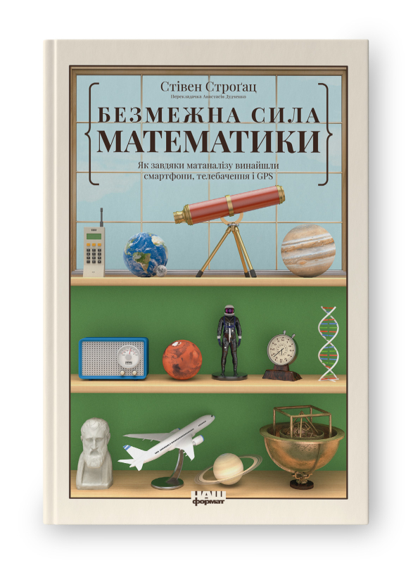
    </td>
    <td>
      <a href="https://nashformat.ua/products/bezmezhna-syla-matematyky.-yak-zavdyaky-matanalizu-vynajshly-smartfony-telebachennya-i-gps-709326">Безмежна сила математики, Стівен Строґац</a>
      </td>
      <td>
      <a href="https://www.linkedin.com/posts/viktorsvertoka_auiavsauyavl-activity-7211683200010448896-pWL2/?utm_source=share&utm_medium=member_desktop">LinkedIn</a>
      </td>
      <td>
      ✅
    </td>
    </tr>
    <tr>
      <td>
      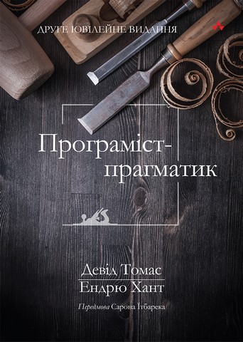
      </td>
      <td>
      <a href="https://balka-book.com/razrabotka_programnogo_obespecheniya-366/programmist_pragmatik_put_ot_podmasterya_k_masteru-2287?utm_source=google&utm_medium=cpc&utm_campaign=pmax_it&utm_content=&utm_term=&gad_source=1&gclid=Cj0KCQiAqL28BhCrARIsACYJvkd3qZbPQh0RHe4USy6lnREwH1zWLhMf3zdyqXh8ptgWDqZaTzaRfpAaAtSYEALw_wcB&lang=ua">Програміст-прагматик, Девід Томас, Ендрю Хант</a>
      </td>
      <td>
      <a href="https://www.linkedin.com/posts/viktorsvertoka_%D0%BF%D1%80%D0%BE%D0%B3%D1%80%D0%B0%D0%BC%D1%96%D1%81%D1%82-%D0%BF%D1%80%D0%B0%D0%B3%D0%BC%D0%B0%D1%82%D0%B8%D0%BA-%D0%B4%D0%B5%D0%B2%D1%96%D0%B4-%D1%82%D0%BE%D0%BC%D0%B0%D1%81-%D1%96-%D0%B5%D0%BD%D0%B4%D1%80%D1%8E-activity-7281912434695503873-CstB/?utm_source=share&utm_medium=member_desktop">LinkedIn</a>
      </td>
      <td>
       ✅
      </td>
      </tr>
      <tr>
      <td>
      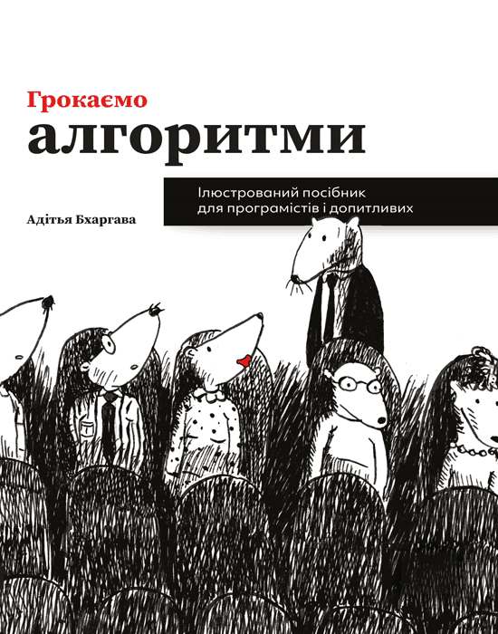
      </td>
      <td>
      <a href="https://www.arthuss.com.ua/shop/hrokayemo-alhorytmy">Грокаємо алгоритми, Адітья Бхаргава</a>
      </td>
      <td>
      <a href="https://www.linkedin.com/posts/viktorsvertoka_%D0%B3%D1%80%D0%BE%D0%BA%D0%B0%D1%94%D0%BC%D0%BE-%D0%B0%D0%BB%D0%B3%D0%BE%D1%80%D0%B8%D1%82%D0%BC%D0%B8-%D1%96%D0%BB%D1%8E%D1%81%D1%82%D1%80%D0%BE%D0%B2%D0%B0%D0%BD%D0%B8%D0%B9-%D0%BF%D0%BE%D1%81%D1%96%D0%B1%D0%BD%D0%B8%D0%BA-activity-7256545259055157248-UOyC/?utm_source=share&utm_medium=member_desktop">LinkedIn</a>
      </td>
      <td>
       ✅
      </td>
      </tr>
      <tr>
      <td>
      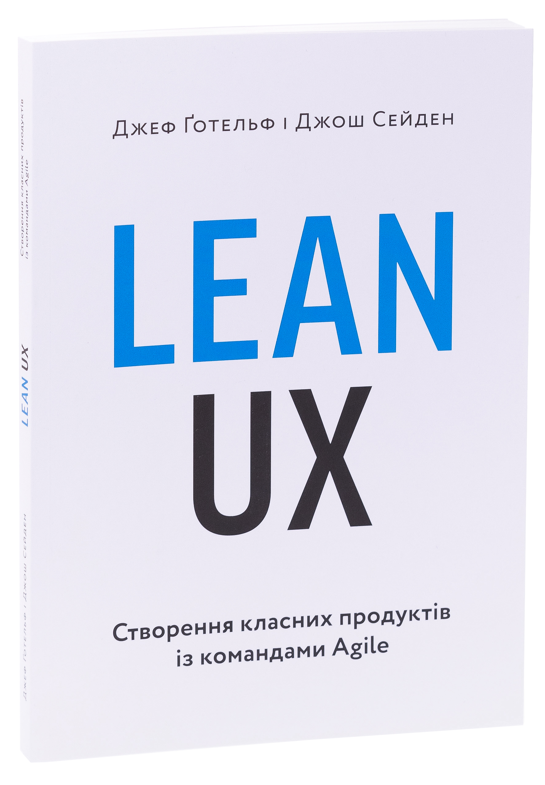
      </td>
      <td>
      <a href="https://www.arthuss.com.ua/shop/lean-ux">Lean UX, Джеф Ґотельф, Джош Сейден</a>
      </td>
      <td>
      <a href="https://www.linkedin.com/posts/viktorsvertoka_%D0%BE%D0%B3%D0%BB%D1%8F%D0%B4-%D0%BA%D0%BD%D0%B8%D0%B3%D0%B8-lean-ux-%D1%81%D1%82%D0%B2%D0%BE%D1%80%D0%B5%D0%BD%D0%BD%D1%8F-%D0%BA%D0%BB%D0%B0%D1%81%D0%BD%D0%B8%D1%85-%D0%BF%D1%80%D0%BE%D0%B4%D1%83%D0%BA%D1%82%D1%96%D0%B2-activity-7251819092880281601-rePI/?utm_source=share&utm_medium=member_desktop">LinkedIn</a>
      </td>
      <td>
       ✅
      </td>
      </tr><tr>
      <td>
      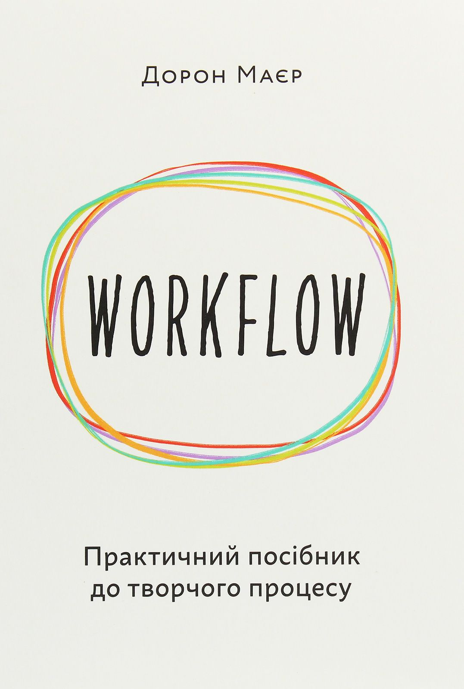
      </td>
      <td>
      <a href="https://www.arthuss.com.ua/shop/workflow">WORKFLOW, Дорон Маєр</a>
      </td>
      <td>
      <a href="https://www.linkedin.com/posts/viktorsvertoka_workflow-%D0%B4%D0%BE%D1%80%D0%BE%D0%BD-%D0%BC%D0%B0%D1%94%D1%80-%D0%BF%D1%80%D0%B0%D0%BA%D1%82%D0%B8%D1%87%D0%BD%D0%B8%D0%B9-%D0%BF%D0%BE%D1%81%D1%96%D0%B1%D0%BD%D0%B8%D0%BA-activity-7268504042237042688-EDwL/?utm_source=share&utm_medium=member_desktop">LinkedIn</a>
      </td>
      <td>
      ✅
      </td>
      </tr>
      <tr>
      <td>
      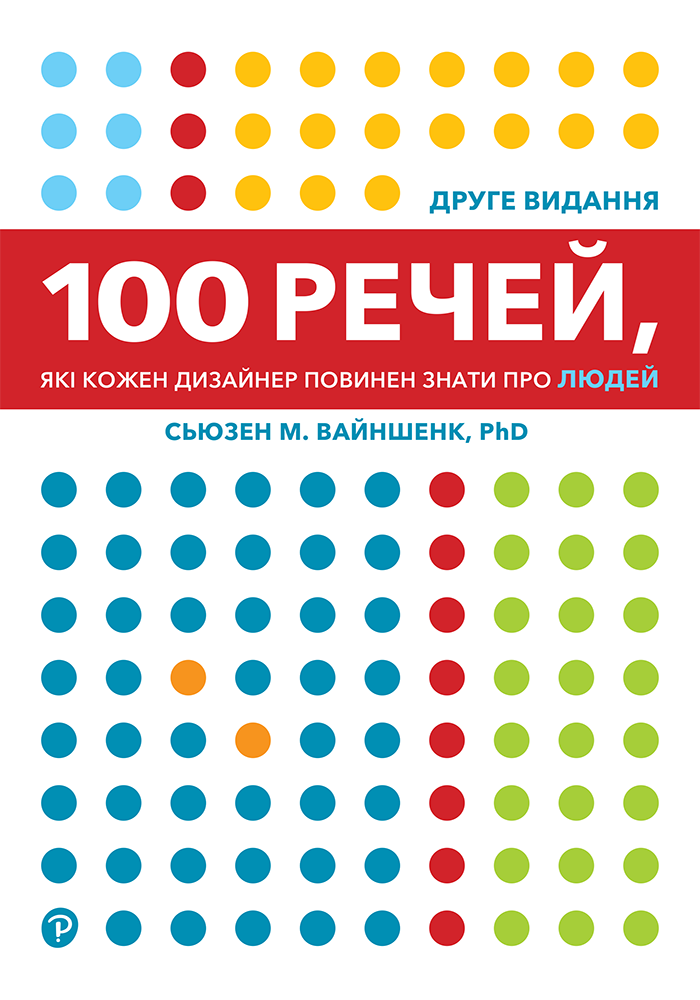
      </td>
      <td>
      <a href="https://www.arthuss.com.ua/shop/100-rechey-yaki-kozhen-dyzayner-povynen-znaty-pro-lyudey">100 речей, які кожен дизайнер повинен знати про людей, Сьюзен М. Вайншенк</a>
      </td>
      <td>
      <a href="https://www.linkedin.com/posts/viktorsvertoka_100-%D1%80%D0%B5%D1%87%D0%B5%D0%B9-%D1%8F%D0%BA%D1%96-%D0%BA%D0%BE%D0%B6%D0%B5%D0%BD-%D0%B4%D0%B8%D0%B7%D0%B0%D0%B9%D0%BD%D0%B5%D1%80-%D0%BF%D0%BE%D0%B2%D0%B8%D0%BD%D0%B5%D0%BD-%D0%B7%D0%BD%D0%B0%D1%82%D0%B8-activity-7276838947597504512-giA8/?utm_source=share&utm_medium=member_desktop">LinkedIn</a>
      </td>
      <td>
       ✅
      </td>
      </tr>
      <tr>
      <td>
      
      </td>
      <td>
      <a href="https://www.arthuss.com.ua/shop/ne-zmushuyte-mene-dumaty">Не змушуйте мене думати, Стів Круґ</a>
      </td>
      <td>
      <a href="https://www.linkedin.com/posts/viktorsvertoka_%D0%BD%D0%B5-%D0%B7%D0%BC%D1%83%D1%88%D1%83%D0%B9%D1%82%D0%B5-%D0%BC%D0%B5%D0%BD%D0%B5-%D0%B4%D1%83%D0%BC%D0%B0%D1%82%D0%B8-%D1%81%D1%82%D1%96%D0%B2-%D0%BA%D1%80%D1%83%D2%91-%D1%80%D0%BE%D0%B7%D1%81%D1%83%D0%B4%D0%BB%D0%B8%D0%B2%D0%B8%D0%B9-activity-7286985868815273984-DgSa/?utm_source=share&utm_medium=member_desktop">LinkedIn</a>
      </td>
      <td>
       ✅
      </td>
      </tr>
      <tr>
      <td>
      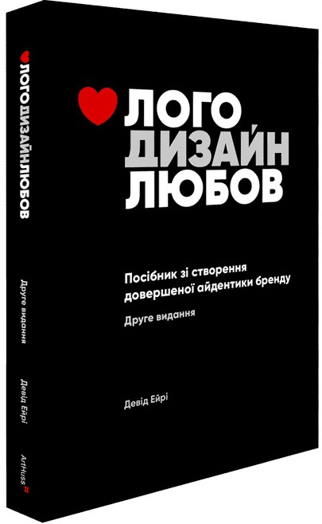
      </td>
      <td>
      <a href="https://www.arthuss.com.ua/shop/loho-dyzayn-lyubov">Лого Дизайн Любов, Девід Ейрі</a>
      </td>
      <td>
      <a href="https://www.linkedin.com/posts/viktorsvertoka_%D0%BB%D0%BE%D0%B3%D0%BE-%D0%B4%D0%B8%D0%B7%D0%B0%D0%B9%D0%BD-%D0%BB%D1%8E%D0%B1%D0%BE%D0%B2-%D0%B4%D0%B5%D0%B2%D1%96%D0%B4-%D0%B5%D0%B9%D1%80%D1%96-%D0%BA%D0%BD%D0%B8%D0%B6%D0%BA%D0%B0-%D0%BF%D0%BE%D1%81%D1%96%D0%B1%D0%BD%D0%B8%D0%BA-activity-7265604933696040960-L_Mw/?utm_source=share&utm_medium=member_desktop">LinkedIn</a>
      </td>
      <td>
       ✅
      </td>
      </tr>
      <tr>
      <td>
      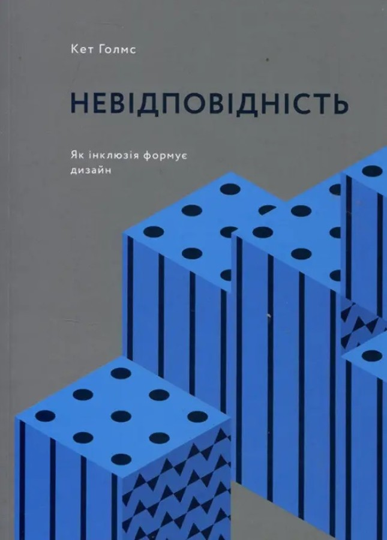
      </td>
      <td>
      <a href="https://www.arthuss.com.ua/shop/nevidpovidnist-yak-inklyuziya-formuye-dyzayn">Невідповідність, Кет Голмз</a>
      </td>
      <td>
      <a href="https://www.linkedin.com/posts/viktorsvertoka_%D0%BD%D0%B5%D0%B2%D1%96%D0%B4%D0%BF%D0%BE%D0%B2%D1%96%D0%B4%D0%BD%D1%96%D1%81%D1%82%D1%8C-%D1%8F%D0%BA-%D1%96%D0%BD%D0%BA%D0%BB%D1%8E%D0%B7%D1%96%D1%8F-%D1%84%D0%BE%D1%80%D0%BC%D1%83%D1%94-%D0%B4%D0%B8%D0%B7%D0%B0%D0%B9%D0%BD-activity-7257994805589266432-FD7y/?utm_source=share&utm_medium=member_desktop">LinkedIn</a>
      </td>
      <td>
       ✅
      </td>
      </tr>
      <tr>
      <td>
      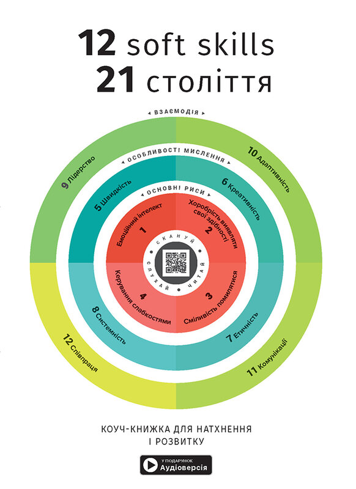
      </td>
      <td>
      <a href="https://bizz.monolith.in.ua/uk/books/kouch-knyzhka-12-soft-skills-21-stolittja">12 soft skills 21 століття, Коуч-книжка для натхнення і розвитку</a>
      </td>
      <td>
      <a href="https://www.linkedin.com/posts/viktorsvertoka_12-soft-skills-21-%D1%81%D1%82%D0%BE%D0%BB%D1%96%D1%82%D1%82%D1%8F-%D0%BA%D0%BE%D1%83%D1%87-%D0%BA%D0%BD%D0%B8%D0%B6%D0%BA%D0%B0-%D0%B4%D0%BB%D1%8F-activity-7260531528802156544-D8bf/?utm_source=share&utm_medium=member_desktop">LinkedIn</a>
      </td>
      <td>
      ✅
      </td>
      </tr>
      <tr>
      <td>
      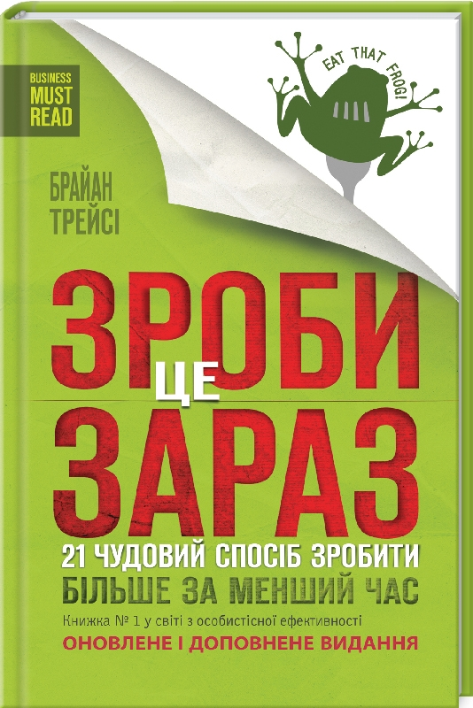
      </td>
      <td>
      <a href="https://bookclub.ua/catalog/books/motivation/zrobi-ce-zaraz-1?srsltid=AfmBOoo48QlXZqgx-xBjhi7LjyG161FJHmJMgRiyzZw17tyrUqe3kJL9">Зроби це зараз, Брайан Трейсі</a>
      </td>
      <td>
      <a href="https://www.linkedin.com/posts/viktorsvertoka_%D0%B7%D1%80%D0%BE%D0%B1%D0%B8-%D1%86%D0%B5-%D0%B7%D0%B0%D1%80%D0%B0%D0%B7-21-%D1%87%D1%83%D0%B4%D0%BE%D0%B2%D0%B8%D0%B9-%D1%81%D0%BF%D0%BE%D1%81%D1%96%D0%B1-%D0%B7%D1%80%D0%BE%D0%B1%D0%B8%D1%82%D0%B8-activity-7274302280785424384-qr7V/?utm_source=share&utm_medium=member_desktop">LinkedIn</a>
      </td>
      <td>
      ✅
      </td>
      </tr>
      <tr>
      <td>
      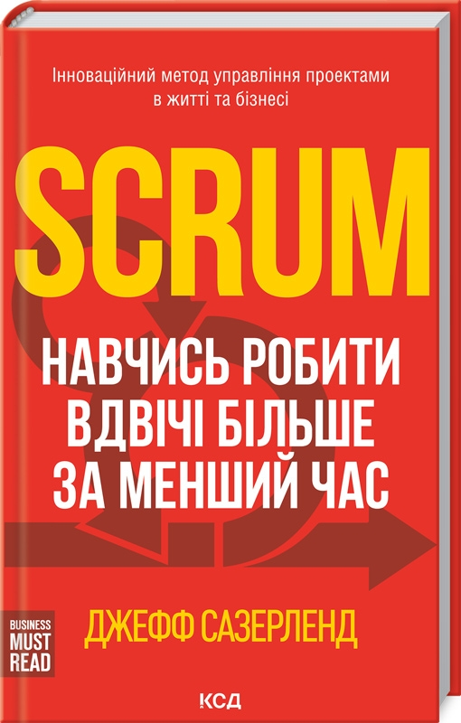
      </td>
      <td>
      <a href="https://bookclub.ua/catalog/books/motivation/scrum-navchis-robiti-vdvichi-bilshe-za-menshiy-chas?srsltid=AfmBOorhcD_vCDihyA3oXmyyFxr2q7PPxxKRqX16dqcxNoRkm-D1NvXE">Scrum. Навчись робити вдвічі більше за менший час, Джефф Сазерленд</a>
      </td>
      <td>
      <a href="https://www.linkedin.com/posts/viktorsvertoka_scrum-%D0%BD%D0%B0%D0%B2%D1%87%D0%B8%D1%81%D1%8C-%D1%80%D0%BE%D0%B1%D0%B8%D1%82%D0%B8-%D0%B2%D0%B4%D0%B2%D1%96%D1%87%D1%96-%D0%B1%D1%96%D0%BB%D1%8C%D1%88%D0%B5-%D0%B7%D0%B0-%D0%BC%D0%B5%D0%BD%D1%88%D0%B8%D0%B9-activity-7279738102753996800-cQgK/?utm_source=share&utm_medium=member_desktop">LinkedIn</a>
      </td>
      <td>
       ✅
      </td>
      </tr>
  </tbody>
</table>
